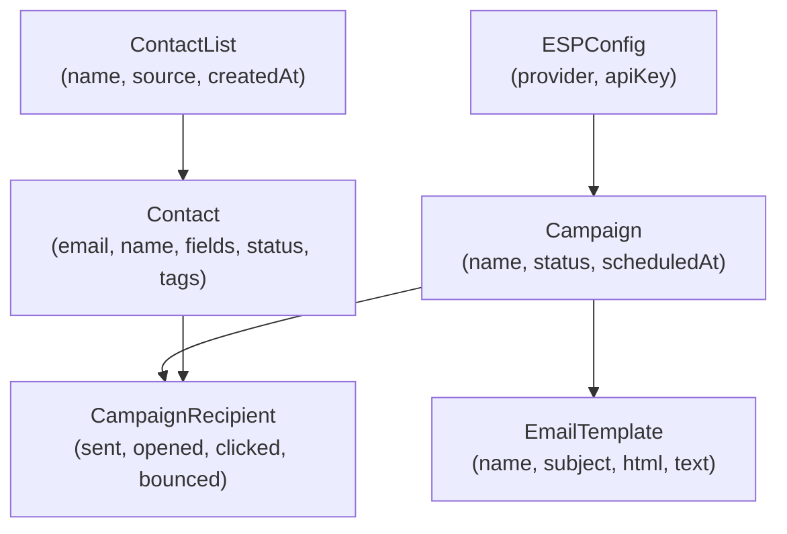

# Bulk Promotional Email Dashboard — Requirements

## Project Summary

An internal, locally-hosted web dashboard that lets staff import a client list, compose promotional emails, select recipients, and send in bulk — with tracking and compliance built in.

---

## Feature Areas

### 1. Contact List Import

**Requirements:**
- Import contacts via CSV upload (columns: email, name, phone, custom fields)
- Import from SQLite / PostgreSQL / MySQL database via connection string or file upload
- Support Excel (.xlsx) as a bonus format
- Auto-detect the email column, or let the user map columns manually
- Validate each email address format on import (flag malformed ones)
- Deduplicate emails — warn if the same address already exists
- Preview imported data in a table before confirming the import
- Store contact lists with a name and creation date (e.g. "May 2026 Promo List")

**Nice-to-have:**
- Merge new imports into an existing list
- Manually add a single contact via a form

---

### 2. Contact List Dashboard (Main View)

**Requirements:**
- Show all contacts in a paginated table (columns: checkbox, name, email, tags, status, date added)
- **Checkbox per row** to select individual recipients
- **Select All / Deselect All** button for the current page and for all filtered results
- Selected count indicator (e.g. "142 contacts selected")
- **Search bar** — filter by name or email in real time
- **Filter panel** with:
  - Filter by tag/group
  - Filter by status (active, unsubscribed, bounced, invalid)
  - Filter by date added range
  - Filter by custom field values (e.g. region, plan type)
- **Sort** columns (name, email, date added)
- Export filtered/selected contacts back to CSV
- Bulk actions on selected: add tag, remove tag, delete, move to group

---

### 3. Contact Groups / Tags

**Requirements:**
- Create named groups (e.g. "VIP Customers", "Newsletter Opt-in")
- Assign one or more tags to each contact
- Filter the main dashboard by group/tag
- When composing a campaign, target an entire group as the recipient set

---

### 4. Unsubscribe & Compliance Management

**Requirements:**
- Mark contacts as **Unsubscribed** — these are excluded from all sends automatically
- Every outgoing email must include a one-click **unsubscribe link** that auto-updates the contact's status
- **Suppression list** — a global block list of addresses that will never be sent to, even if imported again
- Flag contacts with hard bounces and soft bounces
- Show a compliance summary before each send: "X contacts excluded (unsubscribed/bounced)"
- CAN-SPAM / GDPR note: include physical address in email footer (configurable in settings)

---

### 5. Email Template Editor

**Requirements:**
- Rich text (WYSIWYG) editor for composing email body
- Option to switch to raw HTML mode
- Plain-text fallback version (auto-generated or manually edited)
- **Personalization tokens**: insert `{{first_name}}`, `{{company}}`, etc., pulled from contact fields
- Subject line field with token support
- Preview how the email looks with a real contact's data substituted in ("Send test to myself" button)
- Save templates for reuse (name, category, last modified date)
- Duplicate / delete templates

**Nice-to-have:**
- A small library of starter templates (promotional, newsletter, announcement)
- Upload images to embed in the email

---

### 6. Campaign Management

A **campaign** ties together a recipient list + an email template + a schedule.

**Requirements:**
- Create a campaign with: name, subject, template, sender name, reply-to address
- Select recipients by: individual checkbox selection, group/tag, or a saved filter
- Show a **recipient preview** — list of who will receive it, with exclusions explained
- **Send immediately** or **schedule for a future date/time**
- **Draft** status — save a campaign without sending
- Duplicate a past campaign to reuse settings

---

### 7. Sending Engine (Third-Party Service Integration)

The dashboard delegates actual email delivery to a third-party email service provider (ESP) such as SendGrid, Mailgun, AWS SES, or Postmark via their API.

**Requirements:**
- Store the ESP API key and selected provider in Settings (never exposed in the UI after saving)
- "Test connection" button to verify the API key is valid before any send
- The backend calls the ESP's API to dispatch emails — no direct SMTP configuration needed
- Respect the ESP's own rate limits; the backend queues and throttles requests accordingly
- Send in batches; configurable batch size and delay between batches
- Show a real-time progress bar during sending (sent / total, errors, elapsed time)
- On failure, surface the ESP's error message per address and allow retry of failed recipients only
- Pause / cancel an in-progress send

---

### 8. Analytics & Reporting

Requires email tracking pixels and link wrapping (can be disabled for privacy).

**Requirements:**
- Per-campaign stats: sent, delivered, opened, clicked, bounced, unsubscribed
- Open rate and click-through rate (CTR) percentages
- Timeline chart of opens/clicks over 7 days after send
- Per-contact activity log: which emails they received, opened, clicked
- Export campaign report to CSV or PDF
- Dashboard home page with summary cards (total contacts, campaigns sent this month, avg open rate)

**Nice-to-have:**
- A/B test subject lines (send variant A to 50%, variant B to 50%)
- Heatmap of best send times based on historical open data

---

### 9. Settings & Configuration

**Requirements:**
- **Email service provider** selection and API key configuration (with connection test button)
- Default sender name and from-address
- Email footer content (company name, address — for CAN-SPAM)
- Timezone setting (for scheduled sends)
- User accounts with roles: Admin, Editor, Viewer (if multi-user is needed)
- Activity log / audit trail of who sent what and when

---

## Data Model Overview

---

## Suggested Build Phases

- **Phase 1 (MVP)**: Contact import (CSV), dashboard with checkboxes/filter, ESP API integration for sending, unsubscribe link, send log
- **Phase 2**: Template editor with tokens, campaign scheduling, bounce handling, basic open/click tracking
- **Phase 3**: Groups/tags, advanced analytics, A/B testing, multi-user accounts, additional import formats